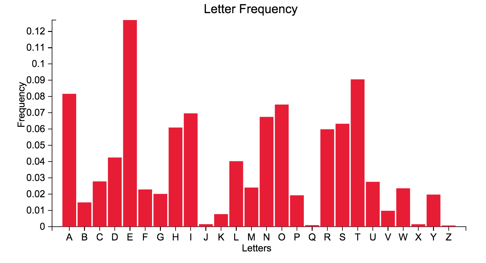
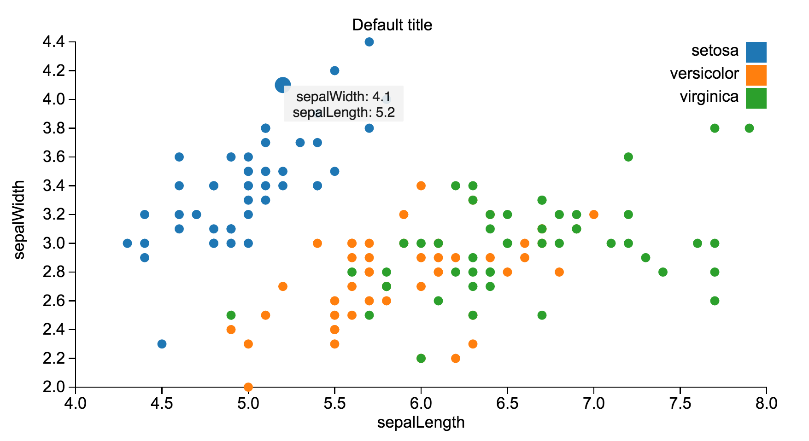

# tl;d3
[](https://travis-ci.org/pbc-labs/tld3)

tld3.js is a lightweight library that makes building [d3.js](http://d3js.org/) graphs much simpler. It abstracts the intricacies of d3.js while harnessing the power of its data-driven DOM manipulation.

## Table of Contents

1. [Usage](#usage)
2. [Requirements](#requirements)
    1. [Installing Dependencies](#installation)
3. [The Basic Idea](#idea)
4. [Why use tld3.js?](#why)
5. [What is tld3.js not good for?](#whynot)
6. [Chart types](#types)
7. [Roadmap](#roadmap)
8. [Contributing](#contributing)

## Usage

Check out our [docs](https://iam-peekay.gitbooks.io/tld3/content/) to get started!

## Requirements

- The latest version of D3.js: [Releases](https://github.com/mbostock/d3/releases)

### Installation
To install:
```sh
npm install --save tld3
```
This assumes that you’re using [npm](https://www.npmjs.com/) package manager. With npm, you can either use a module bundler like Webpack or Browserify to consume CommonJS modules, or if you don't prefer to use a module bundler, you can use ES6 to import tld3.js into your project file(s).

If you aren't using npm or a modern module bundler, you can use a pre-built version from cdnjs and place the src link in script tags in your html file(s). This will make tld3.js available as a global object in your project.

## Idea

__tl;dr:__ Creating a bar chart in tld3.js is as simple as:

__Example 1:__ Using raw JSON data
```javascript
const data = [
              	{	"letter":"A",
              		"frequency":".08167"
              	},
              	{	"letter":"B",
              		"frequency":".01492"
              	},
              	{	"letter":"C",
              		"frequency":".02782"
              	},
              	{	"letter":"D",
              		"frequency":".04253"
              	},
                // ... etc
              ];

// tl;dr :)
tld3.make('BarChart')
    .using(data)
    .in('#barchart');
```



__Example 2:__ Using CSV file

```javascript
tld3.upload('./data/scatterData.csv') // uploading csv data from a file
    .then((data) => {
      tld3.make('ScatterChart')
          .using(data)
          .in('#scatterchart');
    })
    .catch((err) => {
      console.error(err);
    });
```




__Example 3:__ Using Firebase database url
```javascript

tld3.uploadFirebase('https://tld3.firebaseio.com/') // upload data from from Firebase database
    .then((data) => { // if the promise returns successfully, create the chart
      tld3.make('LineChart')
          .using(data)
          .in('#linechart');
    })
    .catch((err) => { // else handle error
      console.error(err);
    });

```


We support data in many formats, including raw JSON or importing data from csv, tsv or JSON files. We now also support Firebase database urls which allows you to have live data updates!

See the [docs](https://iam-peekay.gitbooks.io/tld3/content/) for more information.

## Why

* __Powerful:__ tld3.js rides on [d3.js](http://d3js.org/)'s powerful visualization and data-driven DOM manipulation capabilities
* __Easy-to-use:__ tld3.js offers an extremely simple and expressive syntax
* __Flexible:__ tld3.js is flexible enough to work with several different data formats, including csv, tsv, JSON and even Firebase!
* __Customizable:__ The API offers various ways to customize the charts to best suit your needs
* __Minimal API surface area:__ tld3.js only requires that you learn a handful of methods before you're on your way to making beautiful graphs
* __tl;dr:__ Tooltips and transitions automagically included!

## WhyNot

* Complex physics based d3.js components or animations
* Brushing, zooming and filtering of selections using built in stateful d3 tools
* Anything that requires a lot of DOM mutation, events, timers or internal state

## Types

We currently support the following types of charts:
* Bar chart
* Left bar chart
* Line chart
* Multi-line chart
* Area chart
* Scatter chart
* Donut chart

## Roadmap

View the project roadmap [here](https://github.com/pbc-labs/tld3/issues)

## Contributing

See [CONTRIBUTING.md](CONTRIBUTING.md) for contribution guidelines.

## Team

  - __Product Owner__: [Preethi Kasireddy](https://github.com/iam-peekay)
  - __Scrum Master__: [Banun Atina Idris](https://github.com/banunatina)
  - __Core Contributors__: [Colin Seale](https://github.com/ceseale), [Preethi Kasireddy](https://github.com/iam-peekay), [Banun Atina Idris](https://github.com/banunatina)
